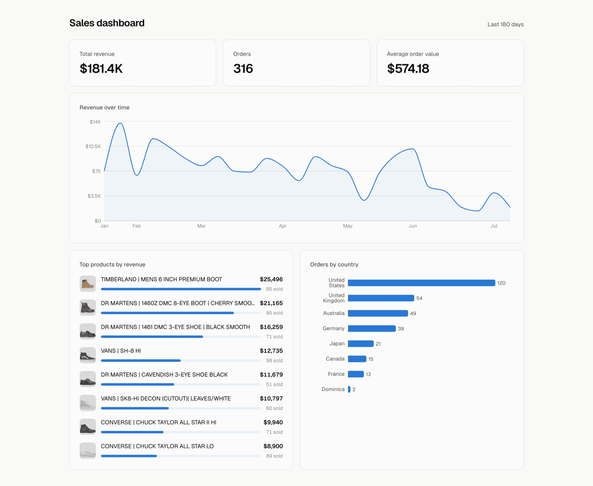
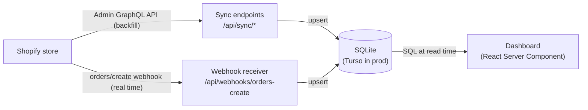

# Shopify Sales Dashboard

A sales analytics dashboard for a Shopify store. It syncs orders and products through the Shopify Admin GraphQL API, receives new orders in near real time through webhooks, and presents sales KPIs on a web dashboard: revenue over time, top products, average order value, and orders by country.

**Live demo:** https://shopify-sales-dashboard-alpha.vercel.app



Built against a Shopify development store with seeded sample data. It can point at any store by changing environment variables.

## 日本語の概要

Shopifyストアの売上分析ダッシュボードです。Shopify Admin GraphQL APIで注文と商品データを同期し、Webhookで新規注文をほぼリアルタイムに受信します。売上推移、売上上位の商品、平均注文額、国別注文数などのKPIを表示します。開発ストアのサンプルデータで構築していますが、環境変数を変更するだけで任意のストアに接続できます。

## How it works

Shopify stays the source of truth. The app keeps a local, query-optimized copy of just the fields the dashboard needs, and computes all stats with SQL at read time.



1. **Backfill:** the sync endpoints (`/api/sync/orders`, `/api/sync/products`) page through the Admin GraphQL API and upsert everything into the database.
2. **Real time:** Shopify calls `/api/webhooks/orders-create` for each new order. The receiver verifies the webhook signature against the raw request body, then upserts the order through the same code path as the sync.
3. **Dashboard:** a React Server Component queries the database directly on each request.

## Tech stack

- Next.js (App Router) with TypeScript
- Tailwind CSS, Recharts
- SQLite via libSQL: a local file in development, [Turso](https://turso.tech) in production
- Shopify Admin GraphQL API and webhooks
- Vitest, GitHub Actions CI, deployed on Vercel

## Project structure

```
app/
  page.tsx                      dashboard (server component, queries the db directly)
  components/                   charts and KPI cards
  api/sync/                     backfill endpoints (secret-protected)
  api/webhooks/orders-create/   webhook receiver (signature-verified)
lib/
  shopify/                      Admin API client, GraphQL queries, webhook signature check
  db/                           client, schema, upserts, aggregate queries
  weekly-series.ts              weekly revenue bucketing
scripts/
  init-db.ts                    create tables and indexes
  seed.ts                       generate backdated demo orders on a dev store
  register-webhook.ts           register the orders/create webhook subscription
```

## Getting started

Requirements: Node.js 20+, a Shopify store with a custom app.

The custom app needs the `read_orders` and `read_products` Admin API scopes. The dashboard itself only reads, `write_orders` is needed only if you want to run the seed script against a development store.

```bash
npm install
cp .env.example .env.local   # fill in the values below
npm run db:init              # create tables (uses file:local.db by default)
npm run dev
```

Then backfill data from the store:

```bash
curl -X POST -H "Authorization: Bearer $SYNC_SECRET" http://localhost:3000/api/sync/products
curl -X POST -H "Authorization: Bearer $SYNC_SECRET" http://localhost:3000/api/sync/orders
```

### Environment variables

| Variable | Purpose |
| --- | --- |
| `SHOPIFY_STORE_DOMAIN` | `your-store.myshopify.com` |
| `SHOPIFY_ADMIN_ACCESS_TOKEN` | Admin API access token from the custom app |
| `SHOPIFY_WEBHOOK_SECRET` | The custom app's API secret key, used to verify webhook signatures |
| `SYNC_SECRET` | Self-chosen secret protecting the sync endpoints |
| `TURSO_DATABASE_URL` | `file:local.db` in dev, `libsql://...` in prod |
| `TURSO_AUTH_TOKEN` | Turso auth token (prod only) |

### Webhook registration

Webhook subscriptions are registered by script rather than clicked together in the admin, so the setup is reviewable and repeatable:

```bash
npm run register-webhook -- https://your-app.vercel.app
```

Pass the deployment's base URL; the script appends the `/api/webhooks/orders-create` path itself. It checks for an existing subscription with the same callback URL before creating one, so re-running it is safe.

## Tests

```bash
npm test
```

The tests cover the three behaviors that would fail silently in production: 
1. Webhook signature verification (a broken check accepts forged requests without any visible error)
2. Weekly revenue bucketing (a wrong week boundary quietly misplaces revenue)
3. Upsert behavior on duplicate delivery (Shopify may deliver the same webhook twice, and a write that inserts instead of updating would count that order twice).

Database tests run against a real in-memory libSQL instance rather than mocks, because what we're testing is the SQL itself.

Lint and tests run in GitHub Actions on every pull request and push to main.

## Decisions and trade-offs

**Local database instead of querying the Admin API per page view.** The Admin API has no analytics endpoints; it returns orders page by page, so "revenue by day" would mean fetching every order and summing in JS on each load, against a rate-limited API. Once the data is local, each chart is one indexed SQL query. The webhook keeps it fresh, the sync keeps it correct.

**Turso in production, a plain SQLite file in development.** Vercel's serverless filesystem is ephemeral, so a SQLite file cannot live there. Turso speaks the same SQL over the network through the same `@libsql/client`, so dev and prod run identical code and only the connection URL changes.

**Custom app token instead of OAuth.** OAuth is for distributable apps installed on many stores. This integration targets exactly one store, so a store-scoped Admin API token is simpler and has fewer moving parts. Shopify labels this route "legacy" since January 2026, but describes it as intended for basic store data integrations, which is exactly this use case.

**Weekly revenue buckets.** At this store's volume (about 1.7 orders per day) a daily chart is noisy due to spikes. Weekly buckets is a more useful view of the data, and empty weeks are kept so the time axis doesn't lie.

**Revenue is gross.** Orders count regardless of financial status, so refunded and pending orders are included. Netting out refunds needs refund line data and is the natural next iteration.

**Prices stored as decimal numbers (SQLite's REAL type).** Decimal columns can carry tiny floating-point rounding errors, so systems that must be exact to the cent (billing, accounting) store whole cents as integers instead. For summing and displaying dashboard totals the error is negligible, so the simpler representation wins.

**Line items keep a copy of the product title and price from when the order was placed.** They are not looked up from the products table at query time, so renaming or repricing a product never changes past revenue. Shopify's own order data works the same way.

**Preview deployments share the production database.** Acceptable here because the dashboard only reads, and the write paths are protected by a secret and safe to run repeatedly (they update existing rows rather than creating duplicates). A production system would give each preview its own database branch.
